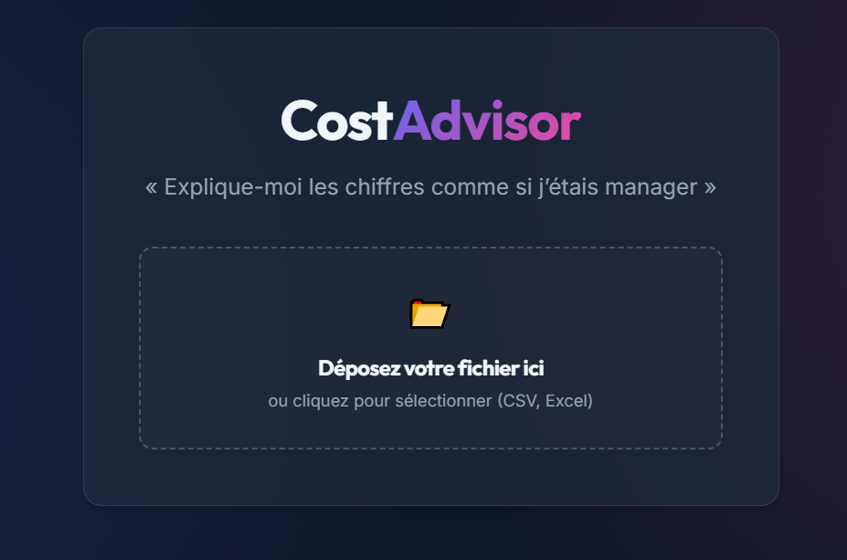
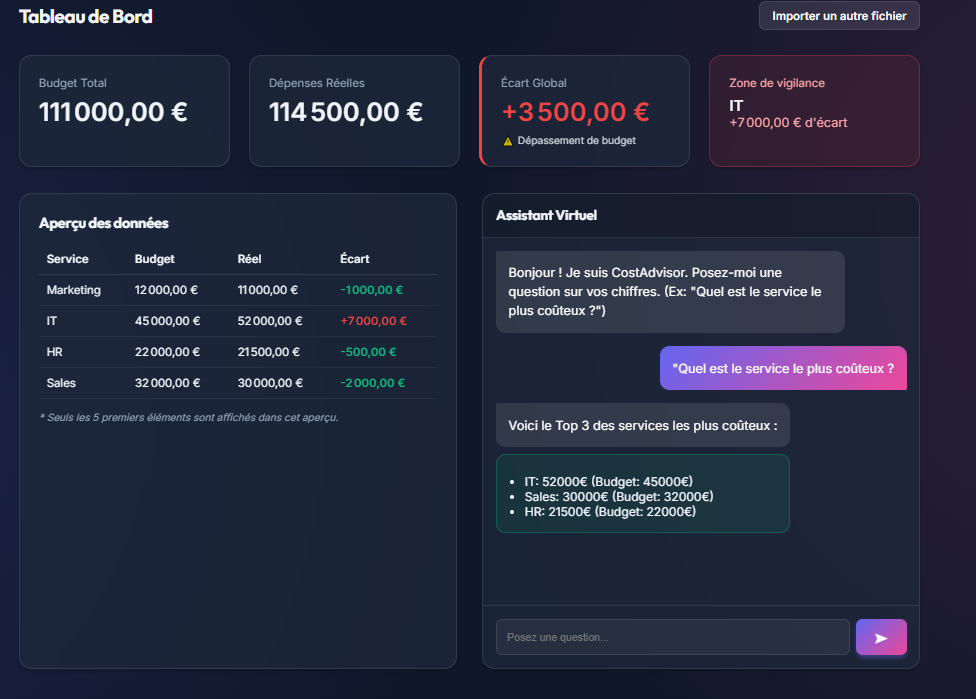

# CostAdvisor 📊

> « Explique-moi les chiffres comme si j’étais manager »

CostAdvisor est un assistant intelligent de contrôle de gestion conçu pour rendre l'analyse financière accessible à tous. Il combine une interface moderne et intuitive avec un moteur d'analyse backend capable d'expliquer les écarts budgétaires en langage naturel.

## Fonctionnalités Principales

-   **Interface Premium** : Design "Glassmorphism" moderne avec mode sombre.
-   **Import Simplifié** : Upload de fichiers CSV ou Excel par glisser-déposer.
-   **Tableau de Bord** : Visualisation claire des Budgets, Dépenses Réelles et Écarts.
-   **Assistant IA** : Chatbot intégré pour poser des questions sur les données (ex: "Quel service dépense le plus ?").
-   **Analyse Automatique** : Détection des "Top Offenders" et explications structurées (Cause, Impact, Recommandation).

## Aperçu de l'application

<p align="center">
  
  
</p>

## Architecture

Le projet est divisé en deux parties :
-   **Backend** (`/backend`) : API développée avec **Python** et **FastAPI**. Utilise **Pandas** pour le traitement de données.
-   **Frontend** (`/frontend`) : Application développée avec **React** et **Vite**, stylisée en CSS pur (Variables & Flexbox/Grid).

## Installation et Démarrage

### Prérequis
-   Python 3.9+
-   Node.js 18+

### 1. Démarrer le Backend
```bash
cd backend
# Créer un environnement virtuel (optionnel mais recommandé)
python -m venv venv
.\venv\Scripts\activate # Sur Windows

# Installer les dépendances
pip install -r requirements.txt

# Lancer le serveur
uvicorn main:app --reload
```
Le serveur sera accessible sur `http://127.0.0.1:8000`.

### 2. Démarrer le Frontend
Créez un nouveau terminal :
```bash
cd frontend
# Installer les dépendances
npm install

# Lancer le mode développement
npm run dev
```
L'application sera accessible sur `http://localhost:5173`.

## Utilisation

1.  Ouvrez `http://localhost:5173`.
2.  Glissez le fichier `test_data.csv` (fourni à la racine) dans la zone d'upload.
3.  Consultez le tableau de bord et utilisez le chat pour interroger vos données.

## Auteur
Projet développé avec l'assistance d'Antigravity.
